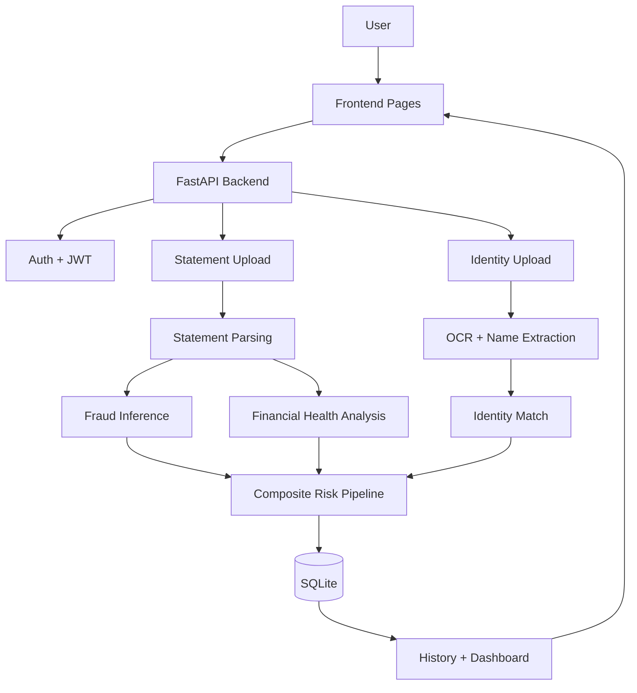
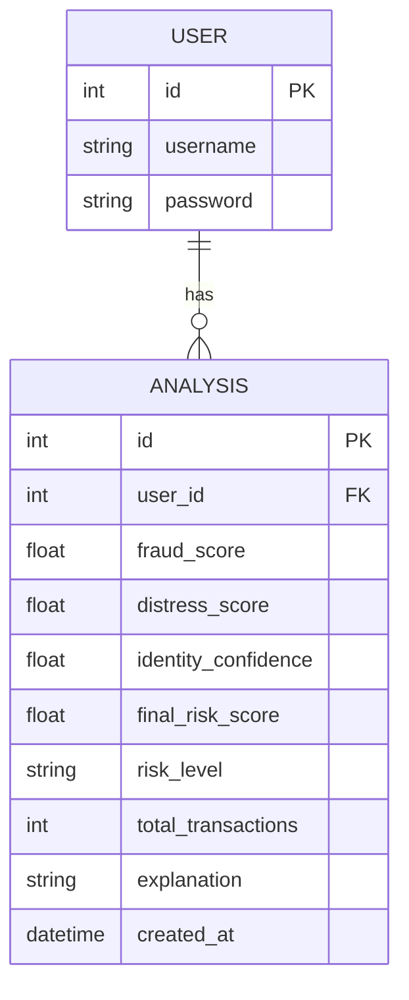
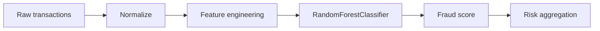
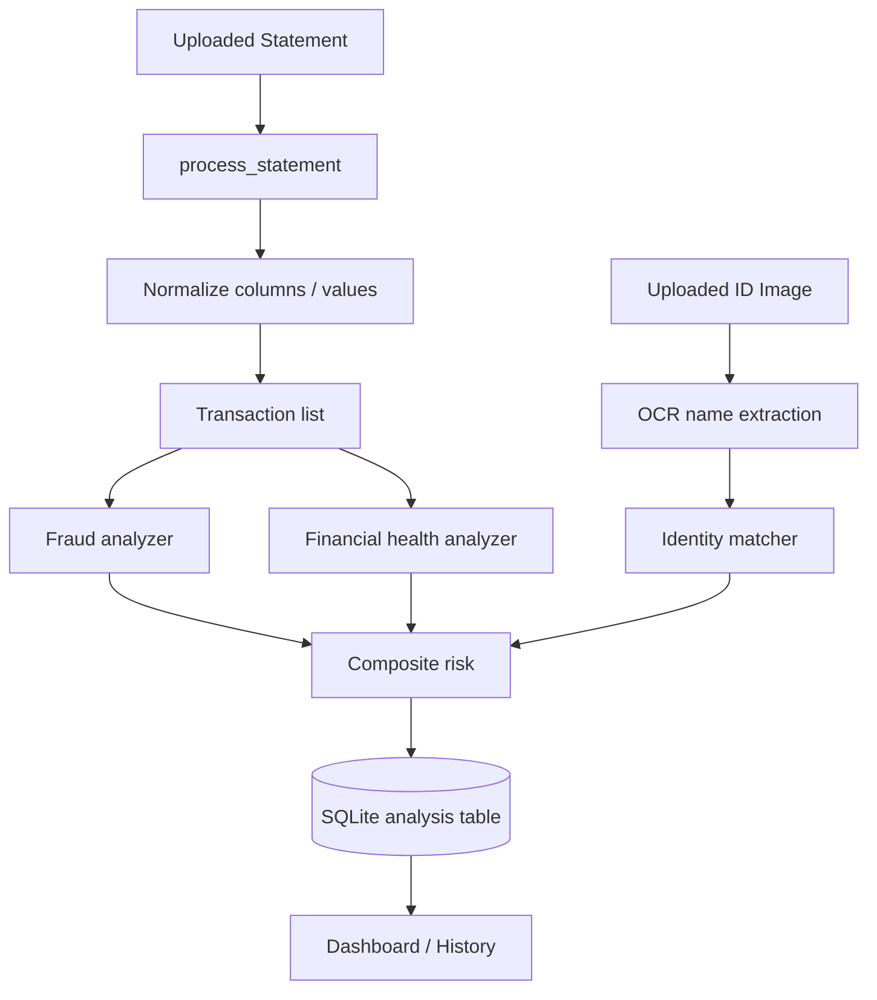
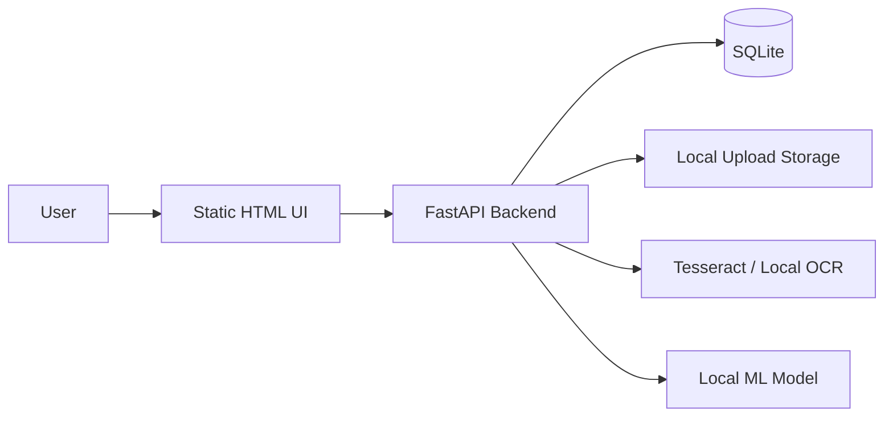

# FinShield AI — Project Idea + Technical Documentation

## 1. Project Overview

This repository implements a prototype financial risk and identity verification platform named FinShield AI. The actual codebase shows a Python backend built with FastAPI, a SQLite database, a static HTML/JS frontend, and several ML/analytics pipelines for fraud detection, financial-health assessment, and identity matching.

The clearest evidence is in [backend/app.py](backend/app.py), [backend/routes/auth_routes.py](backend/routes/auth_routes.py), [backend/services/analysis_service.py](backend/services/analysis_service.py), and the UI in [ivy frontend/dashboard.html](ivy%20frontend/dashboard.html).

The project appears to be designed to answer a practical problem: evaluating whether a user’s financial behavior and identity are trustworthy enough to approve or flag them for risk. The system combines:

- bank statement parsing and normalization
- transaction-level fraud indicators
- financial distress analysis from balances, EMIs, overdrafts, and liquidity stress
- identity verification using OCR and name matching from uploaded IDs
- final composite risk scoring and user history persistence

This is a working prototype rather than a production-grade fintech platform.

## 2. Problem Statement

Financial institutions and digital lending platforms need to assess credit and identity risk quickly, especially when users submit statements and identity documents online. Manual review is slow, expensive, and inconsistent.

This project addresses that by automating:

- extraction of transactions from uploaded financial statements
- detection of suspicious or anomalous spending patterns
- estimation of financial stress or instability
- OCR-based identity verification against the user identity supplied at registration
- risk aggregation into a single decision score

## 3. Motivation

The repository strongly suggests a fintech/KYC risk-assessment workflow. The motivation is to reduce fraud and approve safer decisions by combining user identity and transaction data.

Evidence:
- The app title is “FinShield AI” in [backend/app.py](backend/app.py)
- The user flow includes register, login, upload statement, identity verification, dashboard/history in [ivy frontend/upload_statement.html](ivy%20frontend/upload_statement.html) and [ivy frontend/dashboard.html](ivy%20frontend/dashboard.html)
- The backend risk scoring combines fraud, health, and identity confidence in [backend/pipelines/risk_pipeline/risk_pipeline.py](backend/pipelines/risk_pipeline/risk_pipeline.py)

## 4. Proposed Solution

The application proposes a layered decision engine:

1. User registers and authenticates
2. User uploads bank statement and ID image
3. Statement is parsed and transformed into transaction records
4. Fraud and financial health models score the behavior
5. OCR extracts name from ID image and compares it to the provided username
6. Final score is computed and stored with explanations
7. Results are shown in the dashboard and saved in history

## 5. Objectives

- detect suspicious transaction behavior
- assess financial distress risk
- verify user identity using OCR/name matching
- combine multiple signals into a single risk score
- persist analysis results per user
- provide a demo-friendly web UI for upload and review

## 6. Scope

### Implemented
- FastAPI backend with authentication
- upload endpoints for statements and identity docs
- transaction parsing and normalization
- ML-based fraud inference
- financial health heuristics
- identity verification pipeline
- SQLite persistence
- basic UI for demo usage

### Partially implemented
- PDF statement parsing pipeline exists but not clearly connected to the main endpoint
- OCR and identity verification are present but rely on heuristics and a fixed Windows Tesseract path
- frontend appears to simulate some authentication and OTP flows without real backend integration

### Proposed / implied
- full KYC pipeline for document verification
- production-grade fraud model training and inference
- deployment orchestration
- secure multi-user production auth and file handling

### Future scope
- document classification beyond name matching
- real model retraining pipelines
- production monitoring and alerting
- secure cloud hosting
- role-based controls, audit logs, and compliance workflows

## 7. Key Features

### Feature: User authentication
Purpose: allow registration/login with secure password hashing and JWT-based sessions.

Implementation:
- [backend/routes/auth_routes.py](backend/routes/auth_routes.py)
- [backend/config/security.py](backend/config/security.py)
- [backend/middleware/auth_middleware.py](backend/middleware/auth_middleware.py)

Status: Implemented.

### Feature: Bank statement upload and parsing
Purpose: ingest CSV and other transaction files and convert them into structured records.

Implementation:
- [backend/services/statement_service.py](backend/services/statement_service.py)
- [backend/pipelines/statement_pipeline/normalizer.py](backend/pipelines/statement_pipeline/normalizer.py)
- [backend/pipelines/statement_pipeline/transaction_extractor.py](backend/pipelines/statement_pipeline/transaction_extractor.py)

Status: Implemented for CSV-style flows; PDF logic exists as a component but is not the main active path.

### Feature: Fraud detection
Purpose: estimate fraud probability from transaction patterns.

Implementation:
- [backend/pipelines/fraud_pipeline/fraud_inference.py](backend/pipelines/fraud_pipeline/fraud_inference.py)
- [ml/training/train_model.py](ml/training/train_model.py)
- [ml/training/feature_engineering.py](ml/training/feature_engineering.py)

Status: Implemented with a trained model in the repository and fallback behavior if the model is unavailable.

### Feature: Financial health analysis
Purpose: detect distress signals from EMIs, overdrafts, and low balances.

Implementation:
- [backend/pipelines/financial_health_pipeline/financial_health_pipeline.py](backend/pipelines/financial_health_pipeline/financial_health_pipeline.py)
- [backend/pipelines/financial_health_pipeline/emi_tracker.py](backend/pipelines/financial_health_pipeline/emi_tracker.py)
- [backend/pipelines/financial_health_pipeline/overdraft_detector.py](backend/pipelines/financial_health_pipeline/overdraft_detector.py)
- [backend/pipelines/financial_health_pipeline/liquidity_analysis.py](backend/pipelines/financial_health_pipeline/liquidity_analysis.py)

Status: Implemented as rule-based analytics.

### Feature: Identity verification
Purpose: confirm whether the uploaded ID contains a name matching the registered user.

Implementation:
- [backend/pipelines/identity_pipeline/verification_pipeline.py](backend/pipelines/identity_pipeline/verification_pipeline.py)
- [backend/pipelines/identity_pipeline/ocr_engine.py](backend/pipelines/identity_pipeline/ocr_engine.py)
- [backend/pipelines/identity_pipeline/identity_matcher.py](backend/pipelines/identity_pipeline/identity_matcher.py)

Status: Implemented as a heuristic OCR verification workflow.

### Feature: Risk aggregation and explanation
Purpose: combine signals into one score and produce human-readable reasoning.

Implementation:
- [backend/pipelines/risk_pipeline/risk_pipeline.py](backend/pipelines/risk_pipeline/risk_pipeline.py)
- [backend/pipelines/risk_pipeline/score_aggregator.py](backend/pipelines/risk_pipeline/score_aggregator.py)
- [backend/pipelines/risk_pipeline/risk_level.py](backend/pipelines/risk_pipeline/risk_level.py)
- [backend/pipelines/risk_pipeline/explanation_engine.py](backend/pipelines/risk_pipeline/explanation_engine.py)

Status: Implemented.

### Feature: History
Purpose: show previous analyses for a user.

Implementation:
- [backend/routes/history_routes.py](backend/routes/history_routes.py)
- [backend/services/history_service.py](backend/services/history_service.py)

Status: Implemented.

## 8. Innovation / USP

This project does not appear to introduce a novel machine-learning algorithm. Its value is in combining existing techniques into a single risk-intelligence workflow:

- transaction-level anomaly scoring
- rule-driven financial distress analysis
- OCR-based identity checks
- composite risk scoring from multiple sources

This is more of an applied fintech prototype than a research-grade model.

## 9. Target Users

Likely users include:

- fintech product teams
- digital lenders
- risk analysts
- customer onboarding teams
- internal demo or prototype stakeholders

The product is targeted toward a user-facing onboarding/risk screening workflow.

## 10. System Workflow



## 11. Technical Architecture

The project follows a layered client-server architecture with a modular pipeline design. The main components are:

- web UI as static HTML/JS pages
- FastAPI application as server layer
- service layer orchestrating logic
- pipeline layer for analytics
- SQLAlchemy models for persistence
- SQLite as the database

This is not a microservice architecture. It is a compact monolithic backend with domain-specific processing modules.

## 12. Technology Stack

| Layer | Technology | Notes |
|---|---|---|
| Frontend | HTML, CSS, JavaScript | static pages in [ivy frontend](ivy%20frontend) |
| Backend | Python, FastAPI | main server in [backend/app.py](backend/app.py) |
| Auth | JWT, bcrypt, passlib | configured in [backend/config/security.py](backend/config/security.py) |
| ORM | SQLAlchemy | configured in [backend/config/db.py](backend/config/db.py) |
| Database | SQLite | root database file and SQLite URL in [backend/config/settings.py](backend/config/settings.py) |
| ML | scikit-learn, pandas, joblib | training/inference logic in [ml/training/train_model.py](ml/training/train_model.py) |
| OCR | pytesseract, Pillow | configured in [backend/pipelines/identity_pipeline/ocr_engine.py](backend/pipelines/identity_pipeline/ocr_engine.py) |
| PDF parsing | pdfplumber | in [backend/pipelines/statement_pipeline/pdf_reader.py](backend/pipelines/statement_pipeline/pdf_reader.py) |
| Data processing | pandas, numpy | widely used across pipelines |

No tracked package manifest or requirement file was found in the workspace, so dependency management appears ad hoc or environment-local.

## 13. Project Structure

```text
LedgerGuard/
├── backend/
│   ├── app.py
│   ├── config/
│   │   ├── db.py
│   │   ├── security.py
│   │   └── settings.py
│   ├── core/
│   ├── middleware/
│   ├── models/
│   ├── pipelines/
│   │   ├── behaviour_pipeline/
│   │   ├── financial_health_pipeline/
│   │   ├── fraud_pipeline/
│   │   ├── identity_pipeline/
│   │   ├── risk_pipeline/
│   │   └── statement_pipeline/
│   ├── routes/
│   ├── services/
│   └── uploads/
├── database/
├── docs/
├── ivy frontend/
├── ml/
│   ├── data/
│   ├── inference/
│   ├── models/
│   └── training/
├── storage/
├── finshield.db
└── venv/
```

Key directories:
- [backend/routes](backend/routes): HTTP entrypoints
- [backend/services](backend/services): orchestration logic
- [backend/pipelines](backend/pipelines): ML and analytics modules
- [backend/models](backend/models): SQLAlchemy schema
- [ml/training](ml/training): model training
- [ml/inference](ml/inference): inference helpers
- [ivy frontend](ivy%20frontend): demo front-end pages

## 14. Module Architecture

The backend is organized around domain modules:

- Authentication: [backend/routes/auth_routes.py](backend/routes/auth_routes.py)
- Statement processing: [backend/services/statement_service.py](backend/services/statement_service.py)
- Analysis orchestration: [backend/services/analysis_service.py](backend/services/analysis_service.py)
- Verification orchestration: [backend/services/verification_service.py](backend/services/verification_service.py)
- Risk logic: [backend/pipelines/risk_pipeline/risk_pipeline.py](backend/pipelines/risk_pipeline/risk_pipeline.py)
- History logic: [backend/services/history_service.py](backend/services/history_service.py)

This reflects a modular but not fully separated architecture.

## 15. Database Architecture

The database is SQLite, and the application uses SQLAlchemy.

Main tables:
- users
- analysis

From [backend/models/user_model.py](backend/models/user_model.py) and [backend/models/analysis_model.py](backend/models/analysis_model.py):

- User: id, username, password
- Analysis: id, user_id, fraud_score, distress_score, identity_confidence, final_risk_score, risk_level, total_transactions, explanation, created_at

There is no evidence of complex joins or indexing beyond the standard primary keys and a foreign key relationship from analysis.user_id to users.id.

ER concept:



## 16. API Architecture

Main backend routes:

- POST /auth/register
- POST /auth/login
- POST /analysis/run
- POST /verify/upload
- POST /verify/ocr-test
- GET /history/

Authentication:
- JWT bearer token required by [backend/middleware/auth_middleware.py](backend/middleware/auth_middleware.py)

Request/response pattern:
- JSON for auth and risk results
- multipart file uploads for statements and ID images

Examples:
- registration and login are in [backend/routes/auth_routes.py](backend/routes/auth_routes.py)
- analysis endpoint in [backend/routes/analysis_routes.py](backend/routes/analysis_routes.py)
- verification endpoint in [backend/routes/verification_routes.py](backend/routes/verification_routes.py)

The API handles errors via HTTPException and fallback responses, but it does not implement comprehensive validation or uniform error contracts.

## 17. AI / Machine Learning Architecture

### ML Problem
This project is fundamentally a hybrid:

- classification-like fraud scoring
- rule-based financial risk modeling
- OCR-based identity matching
- composite score generation

### Data
The fraud model is trained from transaction features such as:
- transaction_amount
- amount_deviation
- is_large_txn
- night_transaction

This is built in [ml/training/feature_engineering.py](ml/training/feature_engineering.py). The actual model training script is in [ml/training/train_model.py](ml/training/train_model.py).

### Models
- RandomForestClassifier used in training
- saved via joblib to the model path specified in [backend/config/settings.py](backend/config/settings.py)

### Pipeline


### Evaluation
There is no explicit evaluation report, metrics table, validation split output, or test file in the repo. The model script does split data but does not publish test metrics. That means the code implements training but not a documented evaluation pipeline.

## 18. Data Pipeline

The actual data flow is:

1. Uploaded bank statement or ID image is saved to the backend upload directory
2. Statement parser normalizes columns and values
3. Transaction records are converted to pandas DataFrames
4. Fraud and health analyzers compute component scores
5. Identity OCR extracts names and similarity is scored
6. Risk pipeline aggregates scores into a final risk level
7. Result is persisted in SQLite and returned to the frontend



## 19. Security

### Implemented security
- password hashing with bcrypt in [backend/config/security.py](backend/config/security.py)
- JWT generation and validation in [backend/config/security.py](backend/config/security.py) and [backend/middleware/auth_middleware.py](backend/middleware/auth_middleware.py)
- CORS enabled in [backend/app.py](backend/app.py)
- upload directories exist under backend storage
- SQLite database local to project

### Not clearly implemented
- strict authorization beyond token existence
- role-based access control
- rate limiting
- input sanitization beyond basic Pydantic schema
- secure secret management; the JWT secret is hardcoded as a literal string in [backend/config/settings.py](backend/config/settings.py)
- file-type validation and malware checks for uploaded content
- encryption at rest for database and file uploads

### Security improvement recommendations
- move secrets to environment variables
- validate uploaded file types and scan uploaded documents
- add rate limiting and request throttling
- add proper audit logs and user-level authorization
- use encrypted storage or cloud object storage
- add explicit validation around OCR and transaction processing

## 20. Deployment Architecture

The project does not include Dockerfiles, Compose files, or CI/CD configuration. It is clearly intended as a local prototype.

Likely deployment model:
- Python app served via FastAPI local dev server
- SQLite file database in project root
- static HTML frontend served by a browser directly or a simple static host
- local Tesseract installation required for OCR

This means the deployment target is currently local or internal prototype hosting, not cloud-native production.



## 21. Technical Feasibility

### Feasibility
Yes, the system is technically feasible as a prototype. It uses widely available Python libraries and a simple architecture.

### Scalability
The current design scales poorly for production:
- SQLite is acceptable for local demos, not large-scale multi-user workloads
- upload file handling is local-disk based
- OCR is synchronous and local
- no async queue or worker model exists
- model inference is direct in-request

### Performance
Bottlenecks:
- transaction parsing and pandas transformation
- OCR on each document upload
- local file reads and writes
- synchronous processing in request path

### Data feasibility
The project depends on:
- statement data with transaction date/description/debit/credit/balance
- uploaded identity document with readable text
- user identity strings for matching

This is feasible given typical banking and KYC data formats.

## 22. Testing Strategy

No automated test suite was found in the repository. There are no unit tests, API tests, or ML evaluation scripts beyond model training.

What is currently tested:
- logic exists in code and can be exercised manually
- there are UI behaviors in [ivy frontend/scripts.js](ivy%20frontend/scripts.js)

What should be tested:
- statement parsing for different CSV/PDF structures
- OCR extraction robustness
- identity match thresholds
- JWT auth flows
- database persistence logic
- risk aggregation edge cases
- large-file upload behavior
- fallback behaviors when model is absent

## 23. Limitations and Technical Debt

- hardcoded secrets and Tesseract path in [backend/config/settings.py](backend/config/settings.py) and [backend/pipelines/identity_pipeline/ocr_engine.py](backend/pipelines/identity_pipeline/ocr_engine.py)
- no environment-based configuration
- local file storage without lifecycle policies
- static frontend not integrated to backend in a real client-server manner
- duplicate database code exists in [database/db.py](database/db.py) and [backend/config/db.py](backend/config/db.py)
- empty placeholder file [database/analysis_model.py](database/analysis_model.py)
- no formal dependency manifest
- no tests or CI/CD
- risk model fallback logic is acceptable for demo but weak for real use
- identity verification is heuristic and simplistic

## 24. Development Roadmap

### Phase 1 — Current Foundation
- authentication
- statement parsing
- fraud scoring
- financial health scoring
- identity OCR matching
- history persistence

### Phase 2 — Stabilization
- environment configuration
- file validation
- robust error handling
- standardized API responses
- dependency pinning

### Phase 3 — Core Completion
- real frontend API integration
- stronger OCR and matching logic
- better model training pipeline
- formal user onboarding and KYC flows

### Phase 4 — Testing & Validation
- test coverage
- fraud model evaluation
- document verification tests
- security and auth testing

### Phase 5 — Deployment
- Dockerization
- cloud hosting
- remote database
- CI/CD

### Phase 6 — Scaling
- managed database
- queue-based processing
- ML model versioning
- monitoring and analytics

## 25. Research Potential

This project has limited research novelty, but some applied research value exists in:

- transaction-risk scoring
- rule-based financial distress detection
- hybrid AML/KYC signal fusion
- OCR-based identity matching in low-resource local workflows

It is best characterized as an applied fintech engineering prototype rather than a research platform.

## 26. Existing Approach Comparison

This project sits in the same category as prototype fraud-monitoring or risk-assessment tooling used by fintech and AML platforms. It is not a unique research approach, but it does combine multiple signals into one score.

Compared to production systems, it is simpler:
- no enterprise KYC document verification
- no sophisticated graph analytics
- no real-time transaction stream ingestion
- no audit/compliance workflow

## 27. Expected Impact

### Technical impact
- demonstrates a practical way to combine financial, fraud, and identity signals in a single service
- provides a good prototype architecture for financial risk screening

### User impact
- faster onboarding and risk screening
- more consistent evaluation than manual review
- improved fraud awareness for uploaded statements

### Operational impact
- local prototype can support demos and experimentation
- not yet suitable for regulated production decisioning

### Research impact
- limited, as this is more engineering-driven than research-driven

## 28. Future Scope

High-value extensions:

1. Replace SQLite with PostgreSQL or MySQL
2. Add real document validation and secure uploads
3. Improve OCR with stricter name extraction and document parsing
4. Add monitoring and observability
5. Train a stronger fraud model with real labeled financial data
6. Integrate external compliance and fraud APIs
7. Add visual dashboards and report generation
8. Add notification workflows for flagged risk cases

## 29. Final Technical Summary

FinShield AI is a prototype financial risk intelligence platform that combines transaction analysis, fraud detection, identity verification, and composite scoring into a single workflow. The repository clearly implements the core architecture: a FastAPI backend, SQLite persistence, user authentication with JWT and bcrypt, statement parsing, rule-based financial health analysis, OCR-driven identity matching, and a final score generator.

The strongest evidence is in:
- [backend/app.py](backend/app.py)
- [backend/routes/auth_routes.py](backend/routes/auth_routes.py)
- [backend/services/analysis_service.py](backend/services/analysis_service.py)
- [backend/pipelines/fraud_pipeline/fraud_inference.py](backend/pipelines/fraud_pipeline/fraud_inference.py)
- [backend/pipelines/financial_health_pipeline/financial_health_pipeline.py](backend/pipelines/financial_health_pipeline/financial_health_pipeline.py)
- [backend/pipelines/identity_pipeline/verification_pipeline.py](backend/pipelines/identity_pipeline/verification_pipeline.py)

The project is best understood as a proof of concept for AI-assisted financial trust and fraud screening, not as a production-ready compliance system. It is useful as a technical demo, architecture reference, and foundation for a more robust fintech risk platform.

## 30. Final Project Idea

FinShield AI is a financial risk and identity screening application that helps evaluate whether a user’s transaction behavior and identity documents indicate a trustworthy or risky profile. It uses Python-based data processing, ML inference, OCR, and scoring pipelines to turn uploaded statements and government IDs into a composite risk assessment.

> This project is evidence-based from the implementation in the repository, and it is currently best classified as a functional prototype with clear paths toward a stronger real-world fintech risk platform.
